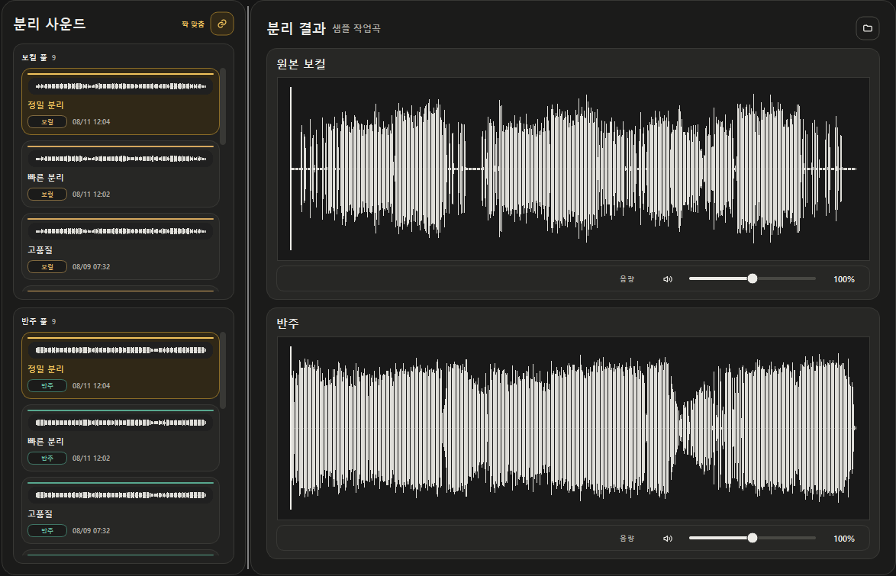

<p align="center">
  
</p>

<h1 align="center">JJZero Audio</h1>

<p align="center">
  음원 등록부터 보컬 분리, RVC 변환, 믹싱과 내보내기까지 하나의 로컬 앱에서.
</p>

<p align="center">
  <a href="README.md"><strong>한국어</strong></a> ·
  <a href="README.en.md">English</a>
</p>

<p align="center">
  <a href="https://github.com/groun519/JJZ-Audio/releases/latest"></a>
  
  
</p>

> [!NOTE]
> 이 문서는 정식 배포된 **JJZero Audio 0.3.6** 기준으로 작성되어 있습니다. 설치 파일은 [GitHub Releases](https://github.com/groun519/JJZ-Audio/releases/latest)에서 받을 수 있습니다.

자동 업데이트 복구, 일반 RVC ZIP 가져오기와 AMD DirectML 수정 사항은 [0.3.6 패치노트](docs/releases/0.3.6.md)에서 확인할 수 있습니다.

<p align="center">
  
</p>

## 하나로 이어지는 제작 과정

```text
음원 등록  →  보컬 분리  →  RVC 변환  →  스튜디오 편집  →  오디오·영상 내보내기
```

JJZero Audio는 RVC 커버 제작 과정에서 생기는 곡, 모델, 분리 결과, 변환본, 편집 내용과 출력물을 하나의 작업공간에서 연결해 관리합니다. 원본 파일과 외부 RVC 폴더를 직접 수정하지 않는 비파괴 방식을 사용합니다.

## 주요 기능

| 작업 영역 | 제공 기능 |
| --- | --- |
| **라이브러리** | 로컬 파일·YouTube 음원 등록, 검색과 정렬, 메타데이터 편집, 미리듣기, 작업곡 관리 |
| **모델** | 기존 RVC 모델 연결·복사, 학습 재료 편집과 분석, 학습·이어 학습, 체크포인트와 인덱스 관리 |
| **보컬 분리** | 빠른·정밀·커스텀 분리, 여러 실행 결과 보존, 보컬·반주 조합 비교와 동기화 재생 |
| **RVC 변환** | 사용할 분리 보컬과 RVC 모델 선택, 여러 변환본 생성·비교, 원본 보컬과 반주를 포함한 청취 |
| **스튜디오** | 오디오·비디오 사운드 풀, 비파괴 타임라인 편집, 분할·트림·이동·뮤트·음량 조절과 믹싱 |
| **내보내기·공유** | 완성 오디오·영상 렌더링, 곡별 결과 관리, Google Drive 기반 모델·결과물 공유 |

한국어와 영어, 라이트·다크 테마, 백그라운드 작업 대기열, 구조화된 오류 진단과 앱 내 업데이트를 지원합니다.

## 빠른 시작

1. [최신 GitHub Release](https://github.com/groun519/JJZ-Audio/releases/latest)에서 `JJZero-Audio-X.Y.Z-Setup.exe`를 받습니다.
2. 설치 프로그램을 실행하고 JJZero Audio를 엽니다. 별도의 Python 설치는 필요하지 않습니다.
3. 첫 실행 설정에서 곡, 모델, 출력물과 실행 환경을 보관할 위치를 선택합니다.
4. 시스템 진단과 장치에 맞는 오디오 처리 환경 설치가 끝나면 음원을 등록합니다.

같은 릴리스에 있는 ZIP 조각과 `latest.json`은 앱 업데이트용 구성요소이며 수동 설치 파일이 아닙니다.

## 지원 환경

JJZero Audio는 **Windows 10/11 x64**를 대상으로 합니다. 첫 실행 시 그래픽 장치를 확인하고 공용 오디오 엔진과 장치에 맞는 가속 프로필만 설치합니다.

| 하드웨어 | RVC 실행 환경 | 모델 학습 |
| --- | --- | --- |
| NVIDIA RTX 50 시리즈 | CUDA 12.8 (`cu128`) | GPU |
| 그 외 지원 NVIDIA GPU | CUDA 11.8 (`cu118`) | GPU |
| 지원되는 AMD Windows ROCm 환경 | `rocm-win` | 실험적 GPU 지원 |
| 그 외 AMD GPU | DirectML 추론 | CPU |
| 지원 GPU 없음 | CPU 대체 실행 | CPU |

새 가속 프로필은 정상 동작이 확인된 뒤에만 활성화됩니다. GPU 환경 구성이 실패해도 기존 데이터와 정상 작동 중인 실행 환경은 유지됩니다.

## 데이터와 업데이트

선택한 저장 위치 아래에 용도별 폴더가 생성됩니다.

```text
JJZero 저장 위치/
  Data/       곡, 모델, 프로젝트와 카탈로그
  Output/     완성된 오디오와 영상
  Runtime/    FFmpeg, 분리 모델, RVC와 가속 프로필
  Cache/      다시 받을 수 있는 패키지와 임시 데이터
```

- 앱 업데이트는 곡, 모델, 스튜디오 프로젝트와 출력물을 유지합니다.
- 저장 위치 변경은 데이터를 복사하고 검증한 뒤 전환하며 이전 위치를 복구본으로 남깁니다.
- 일반 제거는 앱과 생성된 실행 환경·캐시를 지우지만 `Data`와 `Output`은 보존합니다.
- 자세한 저장·이전·삭제 정책은 [저장소와 데이터 안전성](docs/STORAGE.md)에서 확인할 수 있습니다.

## 문서

| 문서 | 내용 |
| --- | --- |
| [개발 환경](docs/DEVELOPMENT.md) | 소스 설치, 로컬 실행, 테스트와 프로젝트 구조 |
| [Windows 빌드](docs/BUILDING.md) | 앱 배포본, 설치 프로그램과 런타임 구성요소 빌드 |
| [릴리스 절차](docs/RELEASING.md) | 버전, 서명, 검증과 GitHub Release 게시 |
| [저장소와 데이터 안전성](docs/STORAGE.md) | 저장 구조, 마이그레이션, 업데이트와 제거 정책 |
| [보컬 분리 모델 조사](docs/vocal-separation-model-survey.md) | 분리 모델의 특성과 비교 연구 |

## 문제 진단

작업 실패 시 앱의 **작업 대기열**에서 진단 보고서를 복사하거나 상세 로그 폴더를 열 수 있습니다. 로그는 기본적으로 `%LOCALAPPDATA%\JJZero Audio\logs`에 저장되며 공유용 보고서에서는 민감한 경로와 계정 정보를 정리합니다.

문제를 재현할 수 있다면 사용한 기능, 장치 정보와 진단 보고서를 함께 [GitHub Issues](https://github.com/groun519/JJZ-Audio/issues)에 남겨 주세요.
