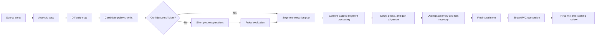

# Adaptive Vocal Separation Research Plan

## Document Status

- Status: Baseline and first hybrid listening rounds complete
- Started: 2026-08-12
- Scope: Vocal separation quality for RVC conversion
- Primary validation: Controlled human listening
- Baseline song: O3ohn - BIG BIRD (problem region: 00:55-01:45)
- Model survey: [Vocal Separation Model Survey](vocal-separation-model-survey.md)

## Goal

Build a general-purpose separation orchestrator that analyzes a song, creates a
segment-level processing plan, runs only the appropriate separation models and
policies for each segment, and joins the results without audible boundaries.

The final optimization target is not separation benchmark score alone. It is the
quality of the RVC-converted vocal and the completed mix.

```text
Song analysis
-> separation difficulty map
-> segment policy plan
-> targeted model execution
-> boundary-safe assembly
-> one consistent RVC conversion
-> final listening review
```

## Non-Goals

- Do not expose every tested model as a user-facing mode.
- Do not treat objective metrics as a substitute for listening.
- Do not download every available checkpoint without screening it first.
- Do not average model outputs blindly.
- Do not modify the original RVC or reference projects.
- Do not integrate an experimental model before its license, runtime cost, and
  listening result are verified.

## Core Decisions

1. Human listening is the final quality decision.
2. Objective analysis is a guardrail for clipping, dropouts, alignment errors,
   reconstruction errors, and other obvious failures.
3. Model names and model families are different concerns. Similar checkpoints
   from the same family are not separate strategies unless they produce a
   meaningful listening difference.
4. The preferred cooperation pattern is capture, refinement, and loss recovery.
   Simple waveform averaging is not the default.
5. Processing policy may change by song segment because vocal level, reverb,
   chorus, instrumentation, and mix density change within one song.
6. The final vocal is assembled before RVC conversion so that one conversion run
   preserves timbre and pitch-processing consistency across the song.

## Terminology

- **Model family:** A distinct separation architecture such as Demucs, RoFormer,
  SCNet, BandIt, Apollo, Mamba, or Conformer.
- **Policy:** A model plus its parameters, optional refinement stages, and
  fallback behavior.
- **Difficulty map:** Time-based description of properties relevant to vocal
  separation, not merely verse and chorus labels.
- **Probe pass:** Short candidate separations used to verify a plan before the
  full segment is rendered.
- **Router:** The component that selects a policy for each segment.
- **Assembly:** Alignment, gain matching, overlap handling, and crossfading of
  processed segments.
- **Listening pack:** Loudness-controlled, blindly named comparison files used
  for human review.

## Target Architecture



## Separation Strategy Groups

### Direct Capture

One model extracts the vocal and instrumental directly.

- Fast and compatibility baseline: current HTDemucs separation.
- Precision baselines: current BS-RoFormer and vocal MelBand-RoFormer.
- Research candidates: one representative checkpoint from each genuinely
  different architecture.

### Vocal Refinement

A second stage removes a specific defect from a captured vocal.

- Instrument bleed reduction
- Conservative de-reverb or effect attenuation
- Lead/background vocal separation
- Noise and codec-artifact reduction

Refinement must be bypassable. If it removes vocal energy or intelligibility,
the previous stage must remain available for automatic recovery.

### Hybrid Cooperation

Multiple models cooperate only where they are complementary.

- Time-segment routing
- Time-frequency mask fusion
- Primary capture plus guarded cleanup
- Primary capture plus loss recovery from a preservation model

### Manual Repair

The user may override an automatic policy or replace a failed segment. This is a
required fallback because no mixture-only analyzer can know the hidden ground
truth vocal perfectly.

## Workstream 1: Model and Evidence Registry

### Purpose

Avoid repeated tests of near-identical models and prevent unsuitable checkpoints
from entering the application.

### Tasks

- Inventory the models and runtimes already present locally.
- Group models by architecture, training target, and intended output.
- Research only primary sources: official repositories, model cards, papers,
  release notes, and author-provided checkpoints.
- Record the following before downloading a large checkpoint:
  - architecture and training target
  - checkpoint source and version
  - license and commercial-use constraints
  - file size and expected installed size
  - GPU memory and system memory expectations
  - CPU, NVIDIA, and AMD runtime support
  - sample rate, channel assumptions, and output stems
  - whether it extracts wet vocal, dry vocal, lead vocal, or general vocal
  - expected benefit over an existing tested model
- Check free disk space before every large download.
- Store experimental checkpoints only in ignored local model/output storage.

### Candidate Families to Screen

- Demucs / HTDemucs
- MelBand-RoFormer
- Band-Split RoFormer
- SCNet
- BandIt
- Apollo
- BSMamba2
- Conformer / BS-Conformer

This list is a research queue, not an integration commitment. A family is tested
only when a credible vocal checkpoint and acceptable license are available.

### Exit Criteria

- Each candidate has a completed registry entry.
- Similar checkpoints are reduced to one representative unless a documented
  training target suggests a meaningful difference.
- No unresolved license or distribution issue remains for integration candidates.

## Workstream 2: Listening Benchmark

### Purpose

Evaluate separation based on the result users actually hear after RVC conversion.

### Reference Material

The benchmark set must grow beyond one song and include:

- effect-heavy vocal
- dry and centered vocal
- quiet, breathy, or whispered vocal
- dense accompaniment with strong spectral overlap
- chorus, harmony, and doubled vocal
- duet or alternating singers
- live or strongly reverberant recording
- compressed or lossy source

The O3ohn problem region at 00:55-01:45 remains the first regression case.

### Listening Pack Contents

For every candidate policy, produce:

1. separated vocal only
2. reconstructed instrumental only
3. RVC-converted vocal only
4. final instrumental plus converted vocal mix

Listening copies are loudness-matched without changing archived raw outputs.
Candidate names are randomized to A, B, C, and so on. The mapping is revealed
only after the review is recorded.

### Review Dimensions

- vocal completeness
- lyric and consonant preservation
- breath and quiet-phrase preservation
- instrumental leakage
- reverb, delay, and backing-vocal contamination
- metallic, watery, phasing, or transient artifacts
- RVC pitch and timbre stability
- final-mix naturalness
- audible segment boundaries

### Objective Guardrails

- clipping and non-finite samples
- unexpected silence or energy collapse
- sample-rate and channel mismatch
- delay and phase mismatch
- discontinuity at segment boundaries
- source reconstruction error
- output gain mismatch

Objective correlation is not a listening score. A high waveform correlation may
only mean that two models make similar mistakes.

### Exit Criteria

- The same listening protocol is repeatable for every model and policy.
- Raw and RVC-converted results can be compared independently.
- A candidate advances only after a human review shows a meaningful benefit.

### Raw Separation Round Result (2026-08-12)

The first blind round compared HTDemucs, BS-RoFormer 317, and Kimberley vocal
MelBand-RoFormer across four fixed clips. All 12 candidate combinations and all
four clip winners were reviewed.

| Clip | Human-selected pair | Best vocal rating | Best instrumental rating |
| --- | --- | --- | --- |
| Dracula easy | HTDemucs | Kimberley MelBand | HTDemucs |
| Popin2 artifact | Kimberley MelBand | Kimberley MelBand | BS-RoFormer 317 |
| 999999 synthetic | Kimberley MelBand | Kimberley MelBand | Kimberley MelBand |
| O3ohn effects | HTDemucs | Kimberley MelBand | HTDemucs |

The selected full-pair winners were split evenly between HTDemucs and Kimberley
MelBand. BS-RoFormer 317 had no full-pair win. Stem-level ratings were more
decisive: Kimberley MelBand was the preferred vocal source in all four clips,
while the preferred instrumental source varied by song.

This is evidence for independent vocal and instrumental selection rather than a
single model-pair policy. The next benchmark must explicitly include hybrid
outputs such as Kimberley vocal plus HTDemucs instrumental. The report and raw
scoring artifact are generated by `scripts/analyze_separation_review.py`.

### RVC Conversion Round Result (2026-08-12)

The same 12 candidates were converted with the fixed `pq-a` model and reviewed
again as converted-vocal solos and final mixes. Converted vocal gain was 100%
and instrumental gain was 35% in every final mix.

| Clip | Human-selected result | Converted-vocal decision | Final-mix decision |
| --- | --- | --- | --- |
| Dracula easy | Kimberley MelBand | Keep | Keep |
| Popin2 artifact | Kimberley MelBand | Keep | Keep |
| 999999 synthetic | Kimberley MelBand | Keep | Keep |
| O3ohn effects | Kimberley MelBand | Keep | Keep |

Kimberley MelBand won all four post-RVC comparisons and was the only candidate
with four keep decisions for both converted vocals and final mixes. HTDemucs
and BS-RoFormer each produced one keep, two repair, and one reject decision for
the converted vocal. The result makes Kimberley MelBand the current default
vocal-capture candidate, but not automatically the default instrumental source.

The listening notes distinguish separator defects from RVC-model limitations.
The Popin2 pronunciation and low-register instability appeared specific to the
fixed `pq-a` model, while O3ohn HTDemucs instability and the unusable 999999
BS-RoFormer conversion were separator-dependent regressions. Dracula also
showed that the preferred Kimberley vocal can coexist with weaker accompaniment
quality and residual original vocal in the corresponding instrumental.

A controlled hybrid round used the current best vocal with the raw-review
instrumental recommendation:

- Dracula: Kimberley vocal plus HTDemucs instrumental
- Popin2: Kimberley vocal plus BS-RoFormer instrumental
- 999999: Kimberley vocal plus Kimberley instrumental
- O3ohn: Kimberley vocal plus HTDemucs instrumental

The generated reports are `blind-review-analysis.md` for raw separation and
`conversion-review-analysis.md` for the RVC round. The hybrid pack compares
only the three clips whose instrumental source changes. It starts with the final
mix while keeping converted vocal, instrumental, and source tracks available at
the same playback position for diagnosis.

### Hybrid Stem Round Result (2026-08-12)

| Clip | Selected vocal | Selected instrumental | Listening result |
| --- | --- | --- | --- |
| Dracula easy | Kimberley MelBand | HTDemucs | Both were clean; HTDemucs was slightly preferred |
| Popin2 artifact | Kimberley MelBand | Kimberley MelBand | Kimberley preserved the snare better than BS-RoFormer |
| O3ohn effects | Kimberley MelBand | HTDemucs | Removed the audible original-vocal residue in the Kimberley instrumental |
| 999999 synthetic | Kimberley MelBand | Kimberley MelBand | Retained from the prior round; no alternate pair was needed |

The recommended hybrid category won two of the three changed-pair comparisons,
and every hybrid candidate remained usable. The strongest improvement was the
O3ohn effect-heavy case: the Kimberley instrumental required repair because the
original singer remained audible, while the HTDemucs instrumental produced a
clean final mix. Dracula showed only a subtle preference, and Popin2 rejected
the raw stem score's BS-RoFormer recommendation because Kimberley preserved an
important snare transient better in the completed mix.

The current evidence supports Kimberley MelBand as the default RVC vocal source
and a song-dependent instrumental choice between Kimberley and HTDemucs. It
does not support BS-RoFormer as the default instrumental fallback. More songs
are required before the instrumental router can be generalized from measurable
audio features.

### Upper-Tier Candidate Raw Round Result (2026-08-12)

The completed upper-tier round used an incremental review instead of repeating
the full questionnaire for previously approved results. Each song was one page:
A was the approved reference, and BS PolarFormer and HyperACE v2 were judged as
better, similar, or worse for vocal and instrumental stems independently.
Candidate codes remained consistent between both tabs and duplicate stems were
removed by hash.

The vocal reference is Kimberley MelBand for every clip. The instrumental
reference is HTDemucs for Dracula and O3ohn, and Kimberley MelBand for Popin2 and
999999, following the prior hybrid round. Only a challenger that beats its
reference advanced to pq-a and final-mix review.

| Clip | Vocal result | Instrumental result | Follow-up |
| --- | --- | --- | --- |
| Dracula easy | No challenger beat Kimberley | No challenger beat HTDemucs | None |
| Popin2 artifact | HyperACE beat Kimberley | HyperACE beat Kimberley | HyperACE pair |
| 999999 synthetic | PolarFormer beat Kimberley | Kimberley retained | PolarFormer vocal + Kimberley instrumental |
| O3ohn effects | Kimberley retained | PolarFormer beat HTDemucs | Kimberley vocal + PolarFormer instrumental |

PolarFormer recorded two better, five similar, and one worse result. HyperACE
recorded two better, four similar, and two worse results. The outcome does not
support replacing the current references globally. It supports retaining both
candidates as possible song-dependent experts, subject to the focused RVC round
and checkpoint license review.

The focused follow-up reuses the already rendered pq-a vocals and mixes only the
three advancing combinations at the fixed 35% instrumental gain. It contains
five decisions: converted vocal and final mix for Popin2 and 999999, plus final
mix only for O3ohn because its converted vocal remains the approved Kimberley
output.

Artifacts are stored outside the product workspace at:

- benchmark manifest: `S:\JJZeroAudioResearch\benchmarks\vocal-separation-candidates-v2\benchmark.json`
- raw review: `S:\JJZeroAudioResearch\benchmarks\vocal-separation-candidates-v2\review\blind-review.json`
- RVC review: `S:\JJZeroAudioResearch\benchmarks\vocal-separation-candidates-v2\review\conversion-review.json`
- incremental review: `S:\JJZeroAudioResearch\benchmarks\vocal-separation-candidates-v2\review\incremental-review.json`
- incremental analysis: `S:\JJZeroAudioResearch\benchmarks\vocal-separation-candidates-v2\review\incremental-review-analysis.md`
- focused RVC follow-up: `S:\JJZeroAudioResearch\benchmarks\vocal-separation-candidates-v2\review\followup-review.json`
- objective reports: `S:\JJZeroAudioResearch\benchmarks\vocal-separation-candidates-v2\analysis`

The review must decide vocal completeness, unwanted sound, reverb/effect
handling, instrumental vocal residue, transient preservation, RVC stability,
and final-mix naturalness separately. The hidden follow-up key must remain
closed until all five comparisons are scored.

## Workstream 3: Song Analysis and Difficulty Map

### Purpose

Describe where and why separation policy should change inside a song.

### Analysis Features

- vocal activity probability
- vocal-to-accompaniment level estimate
- spectral overlap and accompaniment density
- reverb and delay-tail estimate
- doubled-vocal, harmony, or chorus likelihood
- stereo width and center concentration
- transient and sibilance density
- distortion, clipping, compression, and codec artifacts
- confidence and rate of acoustic change

Musical section labels such as verse and chorus may be included, but they are not
sufficient by themselves.

### Segmentation Rules

- Prefer phrase boundaries and stable acoustic regions.
- Avoid cutting through syllables, sustained notes, or reverb tails.
- Merge very short regions unless a severe change requires isolation.
- Add context padding around every processing segment.
- Track confidence for every boundary and segment classification.

### Output

The analyzer produces a versioned difficulty-map artifact containing:

- segment start and end time
- detected properties
- confidence values
- candidate policy classes
- reasons for each recommendation

### Exit Criteria

- The O3ohn effect-heavy region is separated from materially different regions.
- Analysis is deterministic for the same source and version.
- Low-confidence regions are clearly marked for probing instead of receiving an
  unjustified automatic decision.

## Workstream 4: Policy Catalog and Planner

### Initial Policy Classes

- **Balanced:** Default direct separation for ordinary sections.
- **Preserve:** Prioritize quiet vocals, breaths, and complete lyric capture.
- **Clean:** Prioritize removal of strong accompaniment leakage.
- **Effect-aware:** Handle reverb, delay, and doubled vocals conservatively.
- **Harmony-aware:** Preserve or intentionally separate chorus and backing vocals.
- **Manual:** Use an explicitly selected model or prior result.

These names describe behavior. They do not expose model brands to users.

### Planner Behavior

1. Convert difficulty-map features into a policy shortlist.
2. Reuse cached results whenever the model, parameters, source, and segment match.
3. Accept the first policy directly only when confidence is high.
4. Run short probes for uncertain or high-risk segments.
5. Record why a model and parameter set were selected.
6. Produce a complete execution plan before full processing begins.

### Initial Implementation Strategy

- Start with explicit, testable rules.
- Do not begin with a learned router before enough listening labels exist.
- Keep the rule inputs and decisions logged so a learned selector can replace the
  rule engine later without changing the execution pipeline.

### Exit Criteria

- Every segment has one primary policy and optional fallback.
- The planner never silently chooses a model when required assets are unavailable.
- Re-running an unchanged plan does not repeat completed work.

## Workstream 5: Segment Execution

### Requirements

- Process segments with sufficient left and right context.
- Keep the requested output range separate from the padded inference range.
- Support cancellation, progress reporting, and resumable cached work.
- Serialize access when a runtime cannot safely process models concurrently.
- Detect GPU memory failure and apply a documented fallback rather than silently
  changing quality.
- Keep model adapters focused and avoid a broad model-specific utility module.

### Efficiency Strategy

- Run the fast baseline over the full song once.
- Run expensive models only for segments assigned to them.
- Run multiple candidates only for low-confidence probes.
- Cache model outputs using source fingerprint, model version, parameters, and
  padded time range.

### Exit Criteria

- A stopped job resumes without corrupting or duplicating segment outputs.
- Runtime and model failures identify the exact segment and policy.
- Processing a segment never changes the original source or reference projects.

## Workstream 6: Boundary-Safe Assembly

### Requirements

- Measure and correct model latency before combining results.
- Match sample rate, channel layout, gain, and polarity.
- Use overlapping context and equal-power crossfades.
- Prefer mask interpolation when waveform crossfading creates phase artifacts.
- Detect sudden energy or spectral changes across joins.
- Preserve a recoverable copy of each unassembled model result.

### Instrumental Reconstruction

The instrumental may be reconstructed from the correctly scaled final vocal and
source. Normalization performed inside a model runtime must be inverted before
subtraction. The earlier Beta 6X experiment demonstrated that subtracting a
normalized stem from the original-scale source can leave the original vocal in
the mix.

### Exit Criteria

- No audible click, level jump, or timing shift exists at policy boundaries.
- Reconstruction tests cover non-unity model input gain.
- The assembled vocal remains sample-aligned with the source.

## Workstream 7: RVC-Aware Validation

### Requirements

- Assemble the full vocal before conversion.
- Use one stable RVC configuration for benchmark comparisons.
- Compare both vocal solo and completed mix.
- Treat separation improvements that make RVC less stable as regressions.
- Record model, pitch, index, F0 method, device, and runtime profile with every
  comparison result.

### Exit Criteria

- The selected policy improves the converted result, not only the raw stem.
- Segment joins remain inaudible after RVC conversion.
- The same test can be reproduced from recorded metadata.

## Workstream 8: User Experience

### Default Experience

- Keep the normal workflow simple.
- Present Fast Separation and the validated adaptive high-quality workflow.
- Show analysis, planning, processing, assembly, and conversion as distinct
  progress stages.
- Explain additional downloads and storage before they begin.

### Advanced Review

- Show the song timeline with color-coded policy segments.
- Allow a segment to be auditioned against alternative policies.
- Allow the user to lock, replace, merge, or split a segment.
- Show human-readable reasons such as quiet vocal, strong reverb, or dense mix.
- Keep raw architecture and checkpoint details in diagnostics, not primary UI.

### Exit Criteria

- A user can understand why processing changes across the song.
- Automatic output can be corrected without rerunning unrelated segments.
- The UI does not expose unsupported experimental candidates.

## Workstream 9: Learning from Reviews

### Data to Record Locally

- anonymized candidate identifier
- source acoustic features
- selected and rejected policies
- listening scores and notes
- detected objective failures
- RVC settings and outcome

No source audio or user review data is uploaded without an explicit future
decision and consent flow.

### Evolution Path

1. Hand-authored policy rules
2. Rules adjusted from benchmark evidence
3. Lightweight selector trained from listening decisions
4. Optional user-specific preference model

The learned selector must remain replaceable and must not own model execution or
assembly logic.

## Research Phases

### Phase 0: Baseline Freeze

- [ ] Record exact Fast Separation and HTDemucs baseline versions.
- [ ] Preserve the current O3ohn raw, converted, and mix reference files.
- [ ] Finalize the blind listening scorecard.
- [ ] Add regression checks for normalization and alignment mistakes.

### Phase 1: Distinct Model-Family Survey

- [ ] Complete the local and public model registry.
- [ ] Screen checkpoint licenses and hardware requirements.
- [ ] Test one credible representative from each distinct family.
- [ ] Reject candidates that do not differ meaningfully from the baseline.

### Phase 2: Manual Segment Plan Prototype

- [ ] Manually divide the O3ohn problem region by acoustic behavior.
- [ ] Assign policies using listening judgment.
- [ ] Process segments with context padding.
- [ ] Assemble and review boundaries.
- [ ] Convert the assembled vocal with pq-a and review the completed mix.

### Phase 3: Rule-Based Analyzer and Planner

- [ ] Implement the difficulty-map feature extraction.
- [ ] Implement confidence-aware policy rules.
- [ ] Add probe passes for uncertain segments.
- [ ] Compare automatic decisions with the manual reference plan.

### Phase 4: Generalization Benchmark

- [ ] Expand the reference set across the required song categories.
- [ ] Run blind comparisons against Fast Separation.
- [ ] Measure compute time, storage, and failure rate.
- [ ] Tune rules only when improvements generalize beyond one song.

### Phase 5: Product Integration

- [ ] Agree on the final user-facing modes and terminology.
- [ ] Integrate only validated model assets and policies.
- [ ] Add progress, cancellation, cache management, and diagnostics.
- [ ] Verify CPU, NVIDIA, and supported AMD behavior.
- [ ] Package model downloads with versioned manifests and integrity checks.

### Phase 6: Release Validation

- [ ] Run the full listening benchmark.
- [ ] Run focused and complete automated tests.
- [ ] Verify clean install, update, uninstall, and data migration behavior.
- [ ] Verify low-disk and interrupted-download recovery.
- [ ] Document model credits, licenses, and known limitations.

## Experiment Log

| Date | Candidate | Family / Strategy | Region | RVC model | Listening result | Decision |
| --- | --- | --- | --- | --- | --- | --- |
| 2026-08-12 | Current Fast Separation | HTDemucs direct | O3ohn 00:55-01:45 | pq-a | Current baseline | Keep baseline |
| 2026-08-12 | HTDemucs | Demucs direct | O3ohn 00:55-01:45 | pq-a | Missed vocal in effect-heavy material | Compatibility baseline only |
| 2026-08-12 | Beta 6X | MelBand direct | O3ohn 00:55-01:45 | pq-a | Similar to current Fast Separation | Reject as duplicate strategy |
| 2026-08-12 | FV4-based vocal_rvc ensemble | Fixed waveform ensemble | O3ohn 00:55-01:45 | pq-a | Vocal dropout from weak component | Reject |
| 2026-08-12 | Vocal Clean ensemble | Aggressive cleanup | O3ohn 00:55-01:45 | Not advanced | Removed important vocal sections | Reject |
| 2026-08-12 | Beta 6X then Karaoke V2 | Sequential lead-vocal refinement | O3ohn 00:55-01:45 | Not advanced | Removed large vocal regions | Reject |

Add a row after every listening review. Do not overwrite failed experiments;
their evidence prevents repeated work.

## Acceptance Criteria

The adaptive workflow is ready for product integration only when:

- it wins controlled listening comparisons over Fast Separation on multiple song
  categories;
- it does not introduce recurring vocal dropouts or audible joins;
- it improves or preserves RVC conversion stability;
- it has predictable storage and runtime requirements;
- every distributed model has a verified source and acceptable license;
- users can inspect and correct uncertain segment decisions;
- failures are diagnosable from logs without requiring screenshots.

## Open Questions

- Which acoustic features best predict the winning model after RVC conversion?
- Is probe evaluation reliable without ground-truth vocal stems?
- Should reverb be preserved, attenuated, or reconstructed after conversion?
- How should lead and backing vocals be handled for covers and duets?
- What maximum runtime and download size are acceptable for the adaptive mode?
- Which model families have distributable checkpoints for CPU, NVIDIA, and AMD?
- When should the planner prefer manual review over automatic routing?
