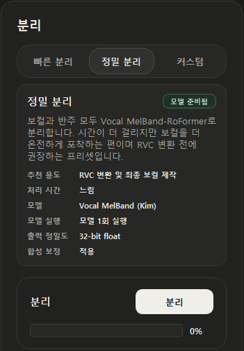
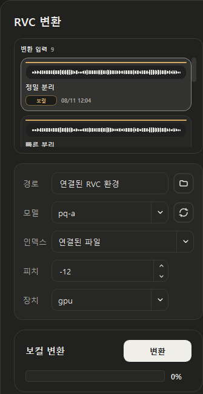
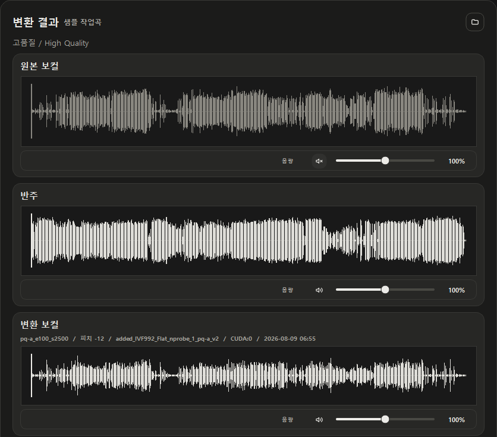
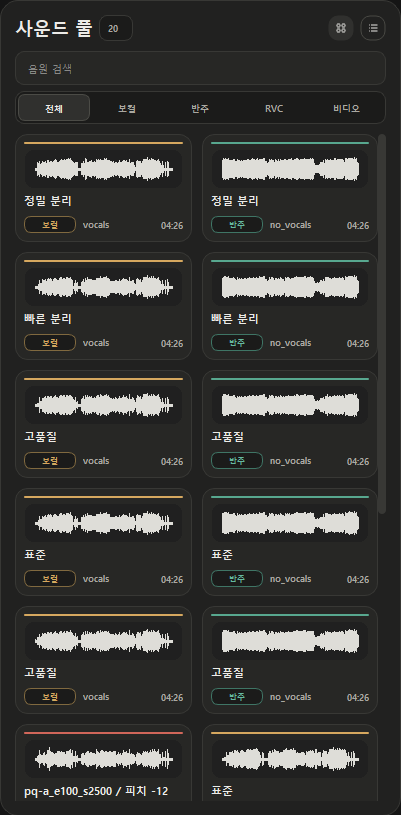
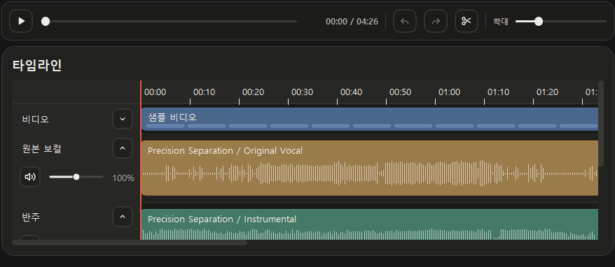

# JJZero Audio 0.3.0

> 보컬 분리부터 RVC 변환, 스튜디오 편집까지 하나의 작업 흐름으로 이어지는 첫 0.3 릴리스입니다.

0.3.0은 보컬 분리 결과를 만들고, 원하는 보컬을 변환한 뒤, 스튜디오에서 직접 조합하는 전 과정을 하나의 작업 흐름으로 다시 구성한 업데이트입니다.

## 핵심 변경 사항

### 목적에 맞게 고르는 보컬 분리

- **빠른 분리**는 비교와 일상 작업에 적합한 HTDemucs 기반 방식입니다.
- **정밀 분리**는 RVC 변환 전 보컬 보존을 우선하는 Vocal MelBand-RoFormer 기반 방식입니다.
- **커스텀 분리**에서는 보컬과 반주 모델을 각각 선택해 곡에 맞는 조합을 시험할 수 있습니다.
- 이전 분리 결과를 덮어쓰지 않고 보관하며, 보컬 풀과 반주 풀에서 원하는 결과를 직접 비교할 수 있습니다.
- 짝 맞춤을 켜면 같은 실행에서 나온 보컬과 반주가 함께 선택되고, 끄면 서로 다른 결과도 자유롭게 조합할 수 있습니다.

**분리 방식 선택**

  

**보컬·반주 결과 선택과 비교**

  

### 변환 입력과 결과를 한 화면에서 비교

- 어떤 분리 보컬을 RVC 입력으로 사용할지 변환 입력 풀에서 직접 선택합니다.
- 여러 번 만든 RVC 결과를 별도의 RVC 풀에 보관해 모델, 피치, 생성 시점을 기준으로 비교할 수 있습니다.
- 원본 보컬, 반주, 변환 보컬을 같은 재생 위치에서 함께 듣고 각 음원의 음소거와 음량을 조절할 수 있습니다.
- `Space` 키로 분리, 변환, 스튜디오 작업 공간의 재생과 일시 정지를 제어할 수 있습니다.

**변환 입력과 RVC 설정**

  

**원본·반주·변환 보컬 비교**

  

### 직접 편집하는 스튜디오

- 곡에서 만들어진 보컬, 반주, RVC 결과와 비디오를 사운드 풀에서 찾을 수 있습니다.
- 필요한 소스를 타임라인에 놓고 이동, 분할, 트림, 음소거, 음량 조절을 비파괴 방식으로 수행합니다.
- 실행 취소와 다시 실행, 타임라인 확대, 재생 위치 이동을 지원합니다.
- 선택한 클립과 트랙의 세부 설정은 우측 속성 패널에서 편집합니다.

**작업 결과를 모아 보는 사운드 풀**

  

**비파괴 편집 타임라인**

  

## 품질 및 안정성

- 정밀 분리용 RoFormer 실행 환경과 모델 다운로드 흐름을 앱 런타임에 통합했습니다.
- 고품질 혼합 보정이 분리된 보컬을 다시 오염시키지 않도록 보컬 추정치를 보존합니다.
- 긴 Windows 경로에서도 RVC 변환이 실패하지 않도록 짧은 임시 작업 경로를 사용하고 결과는 원래 곡 폴더로 복원합니다.
- 새로 만든 분리·변환 결과가 라이브러리와 스튜디오에 즉시 나타나도록 결과 탐색과 카탈로그 동기화를 보강했습니다.
- 작업 공간을 이동해도 재생 위치는 유지하되, 현재 화면에 속한 음원만 재생하도록 범위를 분리했습니다.
- 필요하지 않은 분리·변환·스튜디오·내보내기 결과를 라이브러리에서 안전하게 제거할 수 있습니다.

## 업데이트 전 확인

- 기존 라이브러리, 모델, 작업 결과와 저장 위치는 업데이트 후에도 유지됩니다.
- 정밀 분리는 처음 사용할 때 추가 모델을 내려받으므로 네트워크와 저장 공간이 필요합니다.
- 효과음과 리버브가 많은 곡은 한 가지 방식이 항상 최선은 아닙니다. 빠른 분리와 정밀 분리를 비교하거나 커스텀 분리를 사용해 보세요.
- 앱은 감지된 GPU에 맞는 실행 환경만 설치하며, 지원되는 GPU가 없으면 CPU 방식으로 동작합니다.

정식 설치 파일과 업데이트 안내는 [GitHub Releases](https://github.com/groun519/JJZ-Audio/releases)에서 제공합니다.
