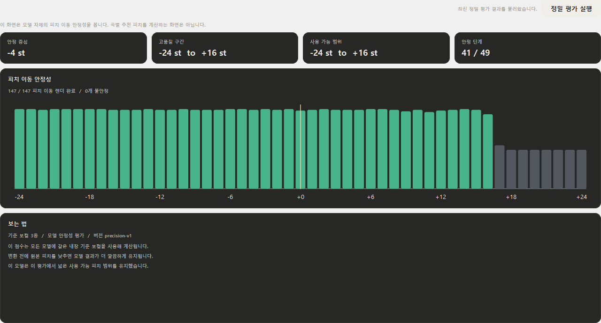
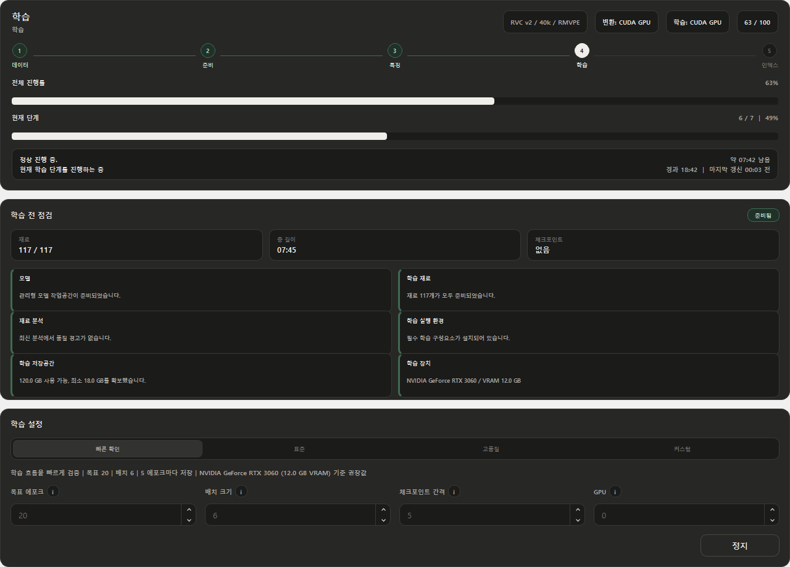
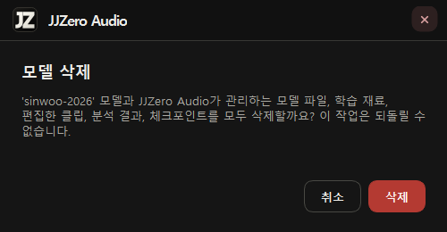

# JJZero Audio 0.3.3

> 모델 평가와 학습 안정성, 긴 보컬 변환과 작업 상태 확인을 강화한 0.3 유지보수 릴리스입니다.

0.3.3은 모델을 평가하고 학습하는 과정에서 진행 상태와 실패 원인을 더 명확하게 보여주고, 긴 곡과 복잡한 저장 경로에서도 RVC 변환을 안정적으로 완료하는 데 집중했습니다. 기존 라이브러리, 모델, 학습 재료, Studio 세션과 출력 파일은 그대로 유지됩니다.

## 모델 평가

- 같은 기준 보컬로 모델별 변환 품질과 피치 이동 안정성을 비교할 수 있는 정밀 평가 화면을 추가했습니다.
- `-24`부터 `+24`까지의 피치 이동 결과를 분석해 권장 범위, 깨끗한 범위와 사용 가능한 범위를 구분해 표시합니다.
- 모델 파일이 변경되면 이전 분석 결과를 그대로 사용하지 않고 새 평가가 필요함을 안내합니다.
- 평가에 사용한 기준 음성과 결과 파일을 다시 확인할 수 있어 모델 선택 근거를 남길 수 있습니다.

  

## 학습 진행과 복구

- 전처리, 피치 추출, 특징 추출, 학습과 인덱스 생성을 실제 진행 단계에 맞게 구분해 표시합니다.
- 경과 시간, 예상 남은 시간과 최근 작업 활동을 보여주어 오래 걸리는 단계가 멈춘 것인지 계속 진행 중인지 확인할 수 있습니다.
- 실패한 학습은 사용 가능한 체크포인트가 있으면 이어서 시작하고, 필요하면 처음부터 다시 시작할 수 있습니다.
- CUDA 메모리가 부족한 경우 더 작은 배치로 다시 시도하고, 일부 특징 추출 결과가 누락되면 안전한 CPU 복구 경로를 사용합니다.
- 손상되거나 불완전한 피치·특징 파일은 기존 정상 결과를 덮어쓰지 않으며, 실패 단계와 실제 실행 로그를 진단 정보에 남깁니다.

  

## RVC 변환 안정성

- 긴 보컬은 겹치는 구간으로 나누어 변환한 뒤 경계가 두드러지지 않게 다시 연결합니다.
- Windows의 긴 경로와 특수문자 제목 때문에 변환이 실패하지 않도록 짧은 관리 작업 경로와 안전한 결과 이름을 사용합니다.
- 변환이 끝난 곡이 현재 작업곡이 아닐 때 재생 중인 곡이나 선택 결과를 임의로 바꾸지 않습니다.
- 변환 실패 시 실제 사용 장치, 적용 설정과 하위 프로세스 오류 내용을 함께 기록해 원인 확인을 쉽게 했습니다.

## 모델 공유와 저장공간

- 추론용 모델뿐 아니라 학습 재료와 체크포인트를 포함한 모델 작업 묶음도 Google Drive로 공유할 수 있습니다.
- 업로드 전에 계정 저장공간을 확인하고, 공간이 부족하면 압축과 업로드를 시작하기 전에 안내합니다.
- 이미 공유된 파일은 다시 업로드하지 않고 링크를 즉시 복사하며, 앱에서 원격 공유 파일을 제거할 수 있습니다.
- Google 계정 메뉴에서 연결 상태와 사용 가능한 저장공간을 함께 확인할 수 있습니다.

## 작업 상태와 화면 동작

- 작업 대기열 버튼을 작업이 없을 때도 항상 표시하고, 실행 중에는 현재 작업 이름과 진행 상태가 보이도록 확장합니다.
- 빈 작업 대기열도 열어볼 수 있으며, 상세 로그 화면에서 작업 대기열로 바로 돌아갈 수 있습니다.
- 긴 오디오의 파형 끝부분과 클립 위치가 실제 재생 시간과 어긋나던 문제를 수정했습니다.
- 변환 입력과 생성 결과의 소유 관계를 분리해 다른 곡이나 이전 결과가 선택 상태를 가로채지 않도록 정리했습니다.

## 모델 데이터 관리

- 모델 라이브러리 행에 마우스를 올리면 완전 삭제 버튼이 나타납니다.
- 삭제 전에 추론 모델 파일과 학습 작업 디렉터리가 함께 제거된다는 내용을 확인할 수 있습니다.
- 외부 연결 모델은 외부 원본을 보존하고 JJZero Audio가 관리하는 학습 작업만 제거합니다.
- 삭제가 끝나면 모델 라이브러리와 모델 정보 화면을 즉시 갱신합니다.

  

## AMD 및 장치 선택

- AMD ROCm 학습은 CUDA용 다중 프로세스 초기화를 사용하지 않고 지원되는 단일 장치 경로로 실행합니다.
- DirectML을 명시적으로 선택했는데 초기화에 실패하면 조용히 CPU로 전환하지 않고 복구 방법을 안내합니다.
- 자동 장치 선택에서 GPU 가속을 사용할 수 없을 때만 CPU로 전환하며, 실제 선택 장치와 실패 원인을 진단 로그에 남깁니다.

## 업데이트 전 확인

- 기존 곡, 모델, 학습 재료, Studio 세션, 출력 파일과 사용자가 선택한 저장 위치는 업데이트 후에도 유지됩니다.
- 0.3.2와 같은 AI 런타임 구성요소를 사용하므로 정상 구성된 환경에서는 대용량 런타임을 다시 받을 필요가 없습니다.
- 정식 설치 파일과 자동 업데이트 구성요소는 [GitHub Releases](https://github.com/groun519/JJZ-Audio/releases)에서 제공합니다.
