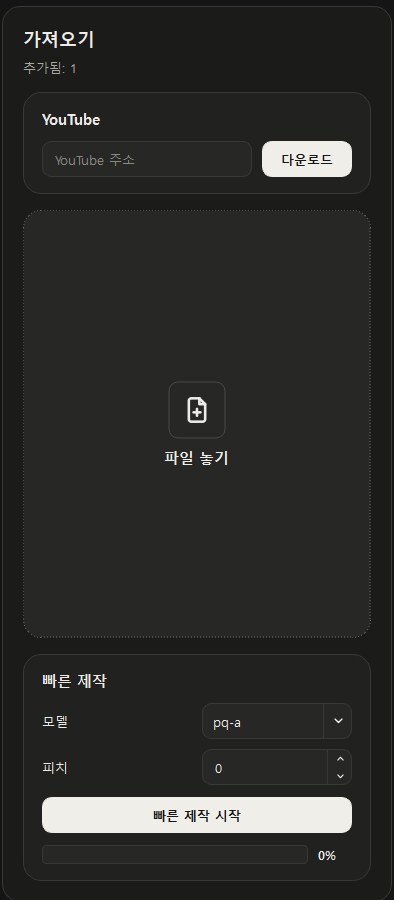
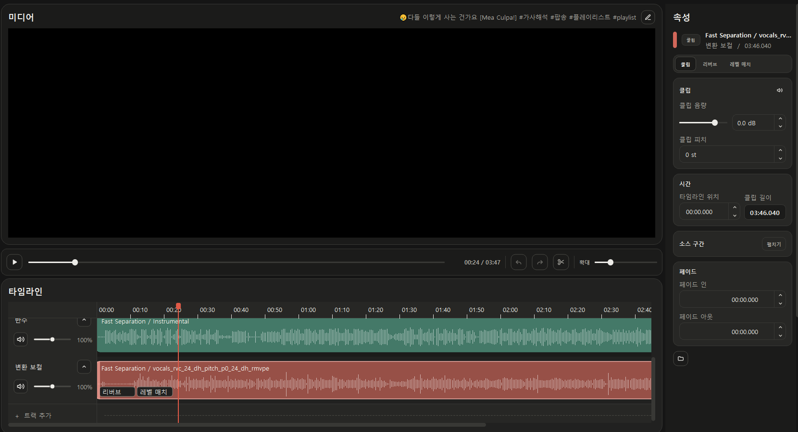

# JJZero Audio 0.3.4

> 곡을 고른 뒤 분리와 변환을 한 번에 끝내고, Studio에서 결과를 더 세밀하게 다듬을 수 있게 한 제작 흐름 업데이트입니다.

0.3.4는 0.3.3의 모델 평가·학습 안정화 기반 위에 원클릭 제작과 Studio 피치 편집을 추가하고, AMD·DirectML·RVC 실행 환경의 진단과 복구를 강화했습니다. 기존 라이브러리, 모델, 학습 재료, Studio 세션과 출력 파일은 그대로 유지됩니다.

## 원클릭 제작

- 라이브러리의 현재 작업곡에서 사용할 RVC 모델과 피치만 고르면 빠른 분리와 균형 품질 변환을 연속으로 실행합니다.
- 이미 사용할 수 있는 빠른 분리 결과가 있으면 다시 분리하지 않고 기존 결과를 재사용합니다.
- 작업이 끝나면 생성된 변환 보컬을 선택한 상태로 Studio를 열어 바로 재생하고 믹싱할 수 있습니다.
- 분리와 변환은 기존 작업 대기열과 진단 로그를 사용하므로 진행 상태와 실패 원인을 같은 위치에서 확인할 수 있습니다.

  

## Studio 피치 편집

- Studio 오디오 클립의 피치를 반음 단위로 조절할 수 있습니다.
- 변경 결과는 현재 재생 위치를 유지한 채 미리 들을 수 있고, 프로젝트를 다시 열어도 설정이 보존됩니다.
- 실시간 재생과 최종 오디오·영상 내보내기가 같은 피치 설정을 사용합니다.
- 피치가 적용된 클립의 상태를 Inspector와 타임라인에서 일관되게 확인할 수 있습니다.

  

## AMD·DirectML·RVC 안정성

- DirectML과 AMD 환경을 별도로 점검해 GPU를 사용할 수 없는 상태와 실제 변환 실패를 구분합니다.
- CUDA, ROCm, DirectML과 CPU 프로필을 활성화하기 전에 실행 가능 여부를 확인하고, 기존 정상 프로필을 불완전한 환경으로 덮어쓰지 않습니다.
- 장시간 학습에서 현재 장치와 처리 활동을 더 자세히 기록해 멈춤과 정상 진행을 구분하기 쉽게 했습니다.
- RVC와 학습 하위 프로세스를 숨김 실행해 작업 중 명령 프롬프트 창이 나타나는 현상을 줄였습니다.

## 작업 흐름과 화면 안정성

- 긴 파형의 끝부분과 Studio 표시 위치가 실제 오디오 시간과 일치하도록 렌더링을 보강했습니다.
- 내보낸 결과가 곡 이름을 유지하도록 파일 이름 처리를 정리했습니다.
- 백그라운드 작업 중 임시 위젯이나 자식 창이 독립 창처럼 나타나는 경로를 추가로 차단했습니다.
- 애플리케이션만 갱신되는 릴리스에서 기존 AI 런타임을 안전하게 재사용하도록 업데이트 호환성 검사를 보강했습니다.

## 업데이트 전 확인

- 기존 곡, 모델, 학습 재료, Studio 세션, 출력 파일과 사용자가 선택한 저장 위치는 업데이트 후에도 유지됩니다.
- 0.3.3과 같은 AI 런타임 구성요소를 사용하므로 정상 구성된 환경에서는 대용량 런타임을 다시 받을 필요가 없습니다.
- 정식 설치 파일과 자동 업데이트 구성요소는 [GitHub Releases](https://github.com/groun519/JJZ-Audio/releases)에서 제공합니다.
