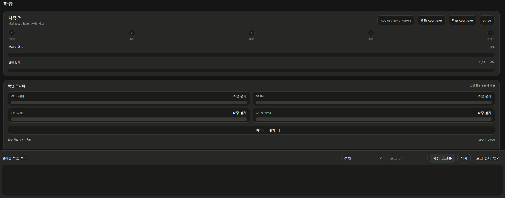
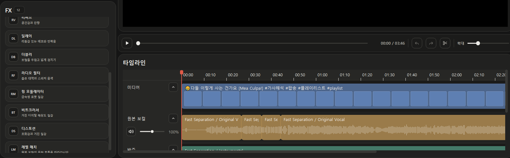

# JJZero Audio 0.3.5

> 장시간 모델 학습의 실제 진행 상태를 읽을 수 있게 만들고, Studio 보컬 공간계 효과를 확장한 안정화 업데이트입니다.

0.3.5는 학습이 멈춘 것인지 정상적으로 처리 중인지 판단할 수 있도록 장치 사용량과 실시간 로그를 한 화면에 모았습니다. Studio에는 Delay와 Doubler, Karaoke 체인을 추가했고, 반복적인 파일 검색과 메타데이터 저장 경로를 정리해 큰 라이브러리와 긴 작업에서도 반응성을 안정화했습니다. 기존 곡, 모델, 학습 재료, Studio 세션과 출력 파일은 그대로 유지됩니다.

## 학습 상태와 로그

- 학습 화면에서 GPU 사용률, VRAM, CPU, 시스템 메모리와 최근 사용량 추이를 확인할 수 있습니다.
- 현재 배치 크기, 데이터 로더 워커와 처리 활동을 함께 표시해 계산 중인지 데이터 공급을 기다리는지 구분합니다.
- 실시간 학습 로그를 수준별로 필터링하고 검색하거나, 자동 스크롤을 멈춘 뒤 필요한 구간을 복사할 수 있습니다.
- 실패한 작업은 런타임, 데이터 로더, 하위 프로세스와 로그를 하나의 진단 ZIP으로 묶어 전달할 수 있습니다.
- 병렬 데이터 로더가 첫 배치를 만들지 못하거나 제한 시간 안에 응답하지 않으면 안전한 단일 프로세스 로딩으로 한 번 복구합니다.

  

## Studio Delay와 Doubler

- Delay는 반복 간격, 피드백, 원음 혼합량과 스테레오 폭을 조절할 수 있습니다.
- Doubler는 보컬 레이어 간격, 피치 분산, 스테레오 폭과 원음 혼합량을 조절할 수 있습니다.
- 두 효과 모두 프리셋을 제공하며 Inspector에서 비파괴 방식으로 다시 편집할 수 있습니다.
- Karaoke 프리셋은 보컬 공간감과 에코를 하나의 편집 가능한 체인으로 추가합니다.
- 실시간 재생, 세션 저장, 오디오·영상 내보내기가 같은 설정을 사용하고 반복음의 끝부분도 잘리지 않게 보존합니다.

  

## 작업공간 성능과 결과 복구

- 곡, 모델, 출력 결과와 보컬 프로젝트 메타데이터를 변경 시점 기준으로 캐시해 같은 파일을 페이지 이동마다 다시 읽지 않습니다.
- Studio는 한 번 만든 사운드 자산 목록을 세션 로드, 편집, 자동 저장과 내보내기까지 공유해 중복 스캔을 줄였습니다.
- 공용 파형 캐시는 여러 화면이 같은 오디오를 다시 분석하지 않게 하며, 오래된 항목은 제한된 크기 안에서 자동 정리됩니다.
- 사용자가 이름을 바꾼 RVC 결과도 등록 정보와 함께 Studio 사운드 풀에 유지합니다.
- 보컬 프로젝트 메타데이터가 없거나 손상돼도 호환되는 기존 RVC 결과를 다시 발견합니다.

## 실행 환경과 저장 안정성

- DirectML의 RMVPE 모델을 실제 검사 작업 폴더에 준비한 뒤 AMD 변환 환경을 검증합니다.
- 학습 워커 시작, 모듈 가져오기, 첫 배치 제한 시간과 장시간 정지를 서로 다른 진단 코드로 구분합니다.
- Windows가 메타데이터 파일을 순간적으로 잠근 경우 짧게 재시도해 곡·모델 상태 저장 실패를 줄였습니다.
- 진단 파일은 계정 토큰이나 인증 정보 없이 작업별 로그와 실행 상태만 포함합니다.

## 업데이트 전 확인

- 기존 곡, 모델, 학습 재료, Studio 세션, 출력 파일과 사용자가 선택한 저장 위치는 업데이트 후에도 유지됩니다.
- 0.3.4와 같은 AI 런타임 구성요소를 사용하므로 정상 구성된 환경에서는 대용량 런타임을 다시 받을 필요가 없습니다.
- 정식 설치 파일과 자동 업데이트 구성요소는 [GitHub Releases](https://github.com/groun519/JJZ-Audio/releases)에서 제공합니다.
