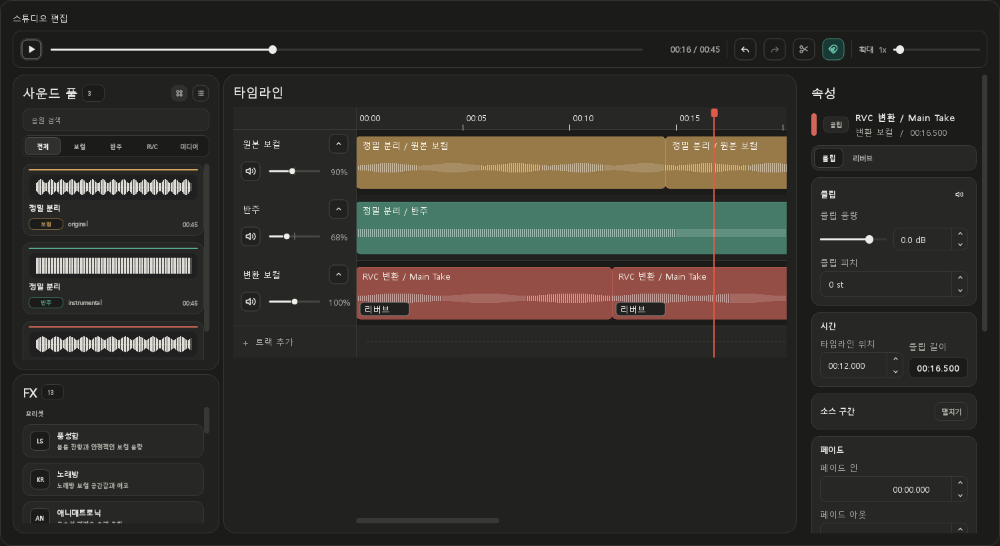

# JJZero Audio 0.3.8

> 긴 프로젝트를 더 정확하게 편집하고, 중단된 RVC 학습과 장치별 실행 환경을 더 안전하게 복구하는 품질 업데이트입니다.

0.3.8은 스튜디오 타임라인의 자석 정렬과 겹침 방지, 분할된 클립에 대한 FX 적용 범위, 학습 재개 상태 복구를 중심으로 다듬었습니다. YouTube 다운로드에는 필요한 JavaScript 실행 환경을 앱에 포함해 PC별 외부 환경 차이도 줄였습니다. 기존 곡, 모델, 학습 재료, 체크포인트, 스튜디오 프로젝트와 출력 파일은 그대로 유지됩니다.

## 스튜디오 자석 편집

- 재생 헤드, 클립 이동, 좌우 트림, 자르기와 사운드 풀 드롭이 같은 자석 기준점을 사용합니다.
- 같은 트랙의 다른 클립과 겹치는 위치는 자동으로 가장 가까운 유효 위치에 배치됩니다.
- `N` 키로 자석 정렬을 켜거나 끌 수 있고, 드래그 중 `Alt`를 누르면 일시적으로 자석 정렬을 우회할 수 있습니다.
- 타임라인 확대 범위를 넓히고 가로 스크롤을 분리해 긴 곡의 짧은 구간도 정밀하게 편집할 수 있습니다.
- 화면에 보이는 클립만 그리며 재생 헤드 주변만 갱신해 긴 프로젝트의 화면 반응을 안정화했습니다.

## FX 적용 범위

- 여러 조각으로 잘린 같은 원본에 FX를 추가할 때 현재 클립만 적용할지, 같은 원본의 모든 조각에 연결할지 선택할 수 있습니다.
- 연결 적용한 FX의 수정과 제거는 같은 원본 조각에 함께 반영되며, 실행 취소와 다시 실행도 한 번의 편집으로 처리됩니다.
- 보컬 공간감을 빠르게 만드는 Lush 계열 프리셋과 레벨 매칭 조합을 정리했습니다.

## RVC 학습 복구

- 중단된 학습의 에포크를 체크포인트, 학습 로그와 내보낸 가중치 이름에서 교차 복구합니다.
- 네이티브 런타임 종료나 데이터 작업자 정지가 감지되면 안전한 단일 작업자 로딩으로 한 번 재시도합니다.
- 손상된 이어 학습 체크포인트를 불러오지 못한 경우 새 학습으로 조용히 덮어쓰지 않고 명확히 실패 처리합니다.
- 저장된 이전 오류도 현재 진단 규칙으로 다시 분류해 원인과 복구 방법을 더 정확히 표시합니다.

## 장치와 업데이트 안정성

- 지원되는 AMD 환경에서는 ROCm 프로필을 먼저 준비하고, 활성화가 실패할 때만 DirectML 대체 구성요소를 내려받습니다.
- 대체 구성요소가 필요하지 않았거나 설치가 끝난 경우 임시 다운로드 파일을 정리합니다.
- 새 변환 결과를 만든 뒤 스튜디오를 다시 열지 않아도 변환 보컬 목록을 갱신합니다.
- 버전이 끝난 미완료 업데이트 파일만 정리하고, 더 새로운 버전의 다운로드는 보존합니다.

## YouTube 호환성

- 앱에 Deno JavaScript 런타임과 현재 `yt-dlp` 스크립트 지원 파일을 포함했습니다.
- 별도의 Node.js나 JavaScript 실행 환경을 설치하지 않아도 YouTube 음원·영상 추출이 같은 실행 경로를 사용합니다.
- 필요한 실행 파일이 누락된 경우 잘못된 포맷 선택으로 진행하지 않고 즉시 이해 가능한 오류를 표시합니다.

## 업데이트 안내

- 0.3.8은 애플리케이션 전용 업데이트이며 기존 0.3.7 AI 런타임 구성요소를 재사용합니다.
- 정상 구성된 PC에서는 대용량 AI 런타임을 다시 받을 필요가 없습니다.
- 설치 프로그램은 기존 데이터 위치와 사용자 자료를 유지합니다.
